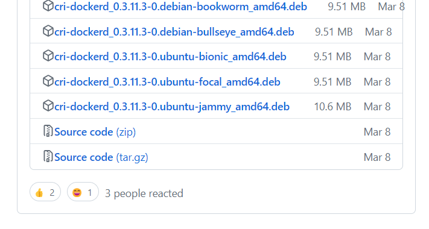
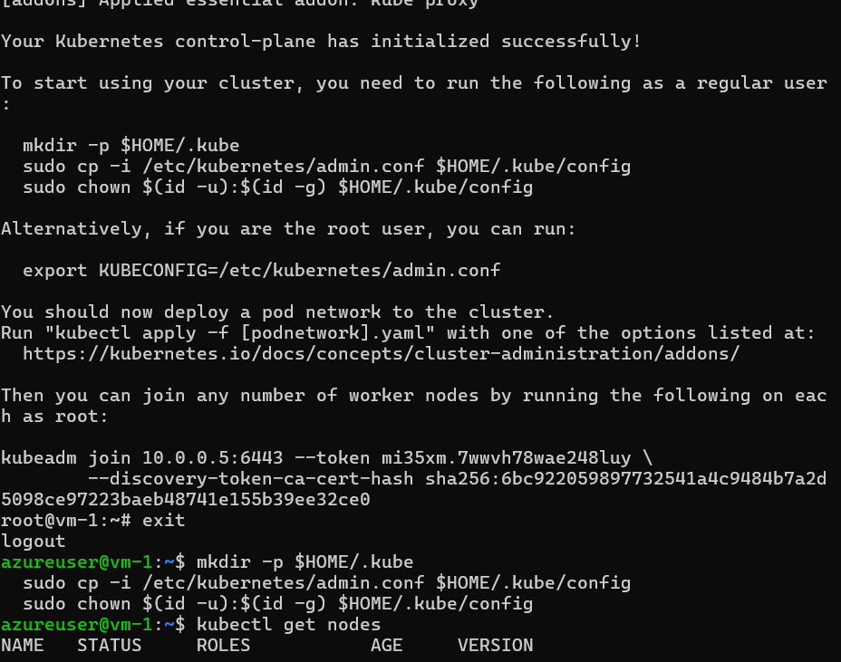
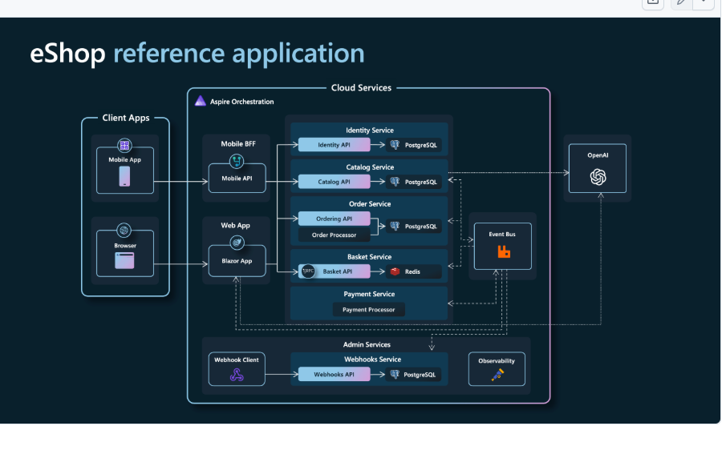
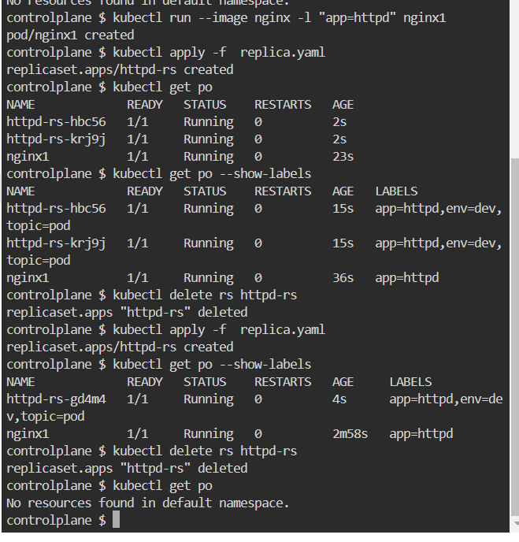
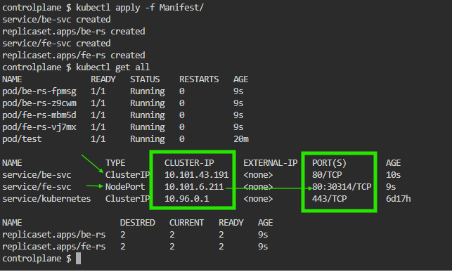
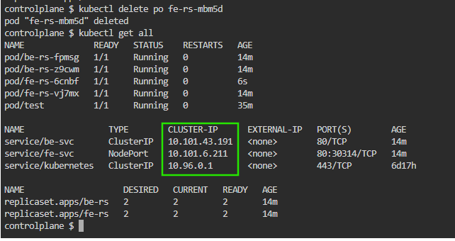
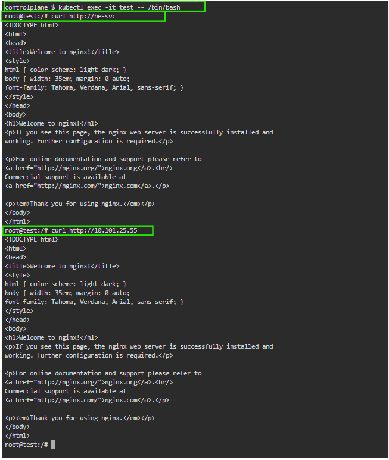

# Kubernetes

* We already know about the containers from docker, As we used run applications and services in containers
* Here as a real time example, our jio cinema streaming the IPL matches these are running on container, when users increased watching we need our containers also increased to handle the load, but as a person we don't know when the load will increases and decreses
* To Solve this problem google worked on this orchestration and developed Kubernetes
* Before docker Google and few companies used to run their ecosystems on containers, Google had their own orchestration softwares like Omega and Barg build by them.
* Google started writing an open source software which does this orchestration(automatically scaling containers,made container to run on production) using language called as GO. That is Kubernetes
* It is open source software
* There are some other softwares similar to k8's in market like AWS ECS, even though k8 got popular since google was made it and it is using for 15 years.
* The features which are there in k8's are eminent compared to others since it is leader 
* K8s started with supporting Docker and it became an enchansment softwaare Docker, when it got bigger they ignored Docker and made to support any kind of containerisation tools.


* Advantages:
    * In k8s whenever you create anything it has label
    * In the world of docker we create container similarly in the world of k8s we create Pods.
    * you can create clones using Replica sets
    * it as SERVICES to speak one part of application with another part of application
    * It has Persistant Volume


* What is Cluster:
    * There some server which runs continers so that our application runs these servers called as Nodes, this creates clusters
    * To run these clusters we have some servers called as Master Nodes.

    * Cluster is combination of two types of servers
        * Master Nodes (Servers which manages Nodes )
        * Nodes (Manages contaier servers)
* As a User we speak with Mater Nodoe, this will speak with nodes to make our job
* To intract with Master Node we have two ways
    * through Kubectl
    * programming libraries
* Kubectl(command line tool):
    * we will write these files using language called YAML
    * These are manifest files
* Programming languages:
    * JSON files

Archetecture :

* ON the Master NODE :

* when ever we are using kubectl we are speaking with kube api server this will speak with etcd(memory of k8s cluster[a key value store]) api server will store that information in etcd.
* to the k8s we always ask what we want, this information is stored in etcd memory, say like you have asked to run nop application on three pods, Scheduler will do this work for us.
* when ever you want to create anythig new scheduler is responsible for this.
* At first schedular will check which node fits for you application to run efficiently among all the nodes it has and it creates a container inside and it starts running app insde.
* Controller Manager is responsible for maintaing the needs perfectly on what you have asked
* say like you have asked for run an application in three pods controller manager always cheks whether the application is running on three pods, for some reason one of the server is down at this time we have 2 pods runnig now controller manager speaks with the api server and stores the information that we have only two pods running not three then api server assigns a job to schedular, schedular will figure out and try to run one more pod, this property is called self healing.

* these all components are called as control plane components because these control k8s clusters
    * kube api server
    * etcd (memory of k8s)
    * controller manager

* ON THE NODE :

* on the nodes we have three componets
    * kubelet ( it is an agent of k8s)
        * it won't take any decision on its own but it will executes whatever the command which comes from control plane
    * Docker run time (you can replace with any container technology)
    * kube proxy (handles networking)


### Overview of k8s components

* Pods :
    * pod is a atomic unit of creation in k8s
    * Pod will have containers in it
    * All the containers in the pod share the same namespaces
    * Each pod gets a unique ip address in the container
    * pod specification will have details about running containers
    * if a container suddenly stops in a pod, k8s will start the container automatically this process is called self healing process

* Replica Set:
    * Replica sets are controller objects (they control certain things)
    * Replica sets create multiple replicas of pods
    * Desired state will be in about pods and number of replicas
* Deployment:
    * This controller helps in performing zero downtime deployments
    * deployment internally creates replicasets and replica sets create pods create container
    * Deployment enables rollouts and rollbacks
* Labels:
    * A label is a key value attached to any k8s object
    * labels are query mechanisms in k8s
* Service:
    * service is used to expose pods with matching labels to 
        * other pods
        * externally to access outside world.

### CRI (Container Runtime Interface)

* CRI is an interface for k8s to communicate with container runtimes
* it is middle ware for k8s and container runtimes
* when you install k8s, along with k8s the CRI which supports docker is also gets installed, they felt k8s getting heavy because of it ad they removed, k8s 1.23 version we will get docker cri included later it was removed

* Maranties is a company which maintains k8s now, this compamy writes a CRI for docker
* OCI(open container initiative):
    * docker image which is built using docker technology can run in other container technologies because it is built with OCI
* after 1.24 version, you need to install docker cri to use docker in k8s

Finally :
    * For k8s to speak with any containarisation tool it needs a CRI
    * it is not that k8s stopped supporting docker, but earlier to speak with docker k8s developed CRI for docker , now it is removed.
    * later from 1.24 other opensource such as cri-dockerd and mirantis written this component

### CNI (container Network Interface)

* This is used for networking implementation in the k8s cluster
* This can also be implemented by any one
* There are many CNI's available.
* it is similar to CRI but CNI is for Networking 

### CSI (Container storage Interface)

* CSI interface helps in creation, updation and management of volumes in various storage sources.

* When you are installing k8s you need to mention which CRI and CNI you need use, later if you are going to use storage you need mention CSI
k8s doesn't have any default CRI or CNI or CSI.

### K8s INstallation options

* Desktops:
    * minikube
    * kind
* On-prem servers
    * kubeadm
    * kubespray
* Cloud based( k8s as a service)
    * AKS (azure)
    * EKS (Aws)
    * GKE (google)


**JUN 11**

Kubernetes setup :
-------------------

* Kubeadm setup:
    * This is a setup where need to have physical or virtual machines with connectivity between them ready i.e we can use this setup on-premises as well as virtual machines
* Managed K8's:
    * This is k8's as a service offered by cloud providers

### Kubeadm

* we need to take two vms which are in same network , we name one of them as Master and other two by Node 1, Node 2.

* Allow all the ports on both vms
* Install the container runtime we, i am going to install docker for now
[docker install link](https://get.docker.com/)
* add current user to docker group `sudo usermod -aG docker azureuser` in both machines
* logout and login again.
* Now install kubeadm, kubelet, kubectl 
```bash
sudo apt-get update
sudo apt-get install -y apt-transport-https ca-certificates curl gpg

curl -fsSL https://pkgs.k8s.io/core:/stable:/v1.31/deb/Release.key | sudo gpg --dearmor -o /etc/apt/keyrings/kubernetes-apt-keyring.gpg

echo 'deb [signed-by=/etc/apt/keyrings/kubernetes-apt-keyring.gpg] https://pkgs.k8s.io/core:/stable:/v1.31/deb/ /' | sudo tee /etc/apt/sources.list.d/kubernetes.list

sudo apt-get update
sudo apt-get install -y kubelet kubeadm kubectl
sudo apt-mark hold kubelet kubeadm kubectl

```
* now install docker cri [refere here for docker cri](https://github.com/Mirantis/cri-dockerd/releases)



* here we choose Jammy
```bash
wget https://github.com/Mirantis/cri-dockerd/releases/download/v0.3.11/cri-dockerd_0.3.11.3-0.ubuntu-jammy_amd64.deb

```
* now do this 
```bash
sudo dpkg -i cri-dockerd_0.3.11.3-0.ubuntu-jammy_amd64.deb
```
* now switch to root user
```bash
sudo -i 
```
* now if you do `kubeadm init` it won't work because, we have two cri's installed,execute it and read the info. we need to say which one to use 

```bash
in Root mode 
kude
kubeadm init --cri-socket unix:///var/run/cri-dockerd.sock
```
* After this you will get successfull message 


**Till now for both servers above is common, from now things will change**

For Node servers:
----------------
* here in this messgae we see `kubeadm join ...`script we need to execute this script in the servers which we need to join with our master node.
```bash
kubeadm join 10.0.0.5:6443 --token mi35xm.7wwvh78wae248luy \
        --discovery-token-ca-cert-hash sha256:6bc922059897732541a4c9484b7a2d5098ce97223baeb48741e155b39ee32ce0

here we need to define which cri to be used and execute it because for above script there is nothing mentioned

THIS SHOULD BE EXECUTED IN ROOT MODE   

kubeadm join 10.0.0.5:6443 --token mi35xm.7wwvh78wae248luy \
        --discovery-token-ca-cert-hash sha256:6bc922059897732541a4c9484b7a2d5098ce97223baeb48741e155b39ee32ce0 --cri-socket "unix:///var/run/cri-dockerd.sock"

```
* thats it for Node server, now we should intilize the kudeadm in master server and check nodes.

For Master Node :
-----------------
* now come back to normal user `exit`
* take the piece of code given and execute it
```bash
 mkdir -p $HOME/.kube
  sudo cp -i /etc/kubernetes/admin.conf $HOME/.kube/config
  sudo chown $(id -u):$(id -g) $HOME/.kube/config

```
* now check the nodes using kubectl `kubectl get nodes`
* this shows nodes are not ready 
* to start them we need CNI to be there. we know two things are necesary in k8's, 1.CRI and 2. CNI
* again here there are many CNI available, we are going with Weave
* go to this link [refer link](https://github.com/rajch/weave#using-weave-on-kubernetes)
```bash

kubectl apply -f https://reweave.azurewebsites.net/k8s/v1.29/net.yaml
```
* To run the nodes
```bash
kubectl get nodes -w
```
* check again `kubectl get nodes` it should be runnning now


How Kubectl works
-----------------

* kubectl is the tool which intracts with API server for the inputs which we give
* kubectl will have communication with API server over https.
* kubectl will use a configuration file, this file having the information of certificates that belongs to API servers.


Script:
-------
```yaml
apiVersion: v1
kind : Pod
metadata:
  name: hello-pod
spec:
  containers:
    - name: hello-container
     image: nginx:latest
     ports:
        - containerPort: 80


```

```yaml

apiVersion: v1
kind: Pod
metadata:
  name: activity-1
  labels:
    app: nop
    env: dev
    purpose: 
spec:
```

Kubernetes Pods
---------------

* Pod have three types of containers
    * init containers
    * containers
    * ephemeral containers
* init container:
    * these are executed sequntially(series one up on other)
    * one must be completed to execute next
* containers:
    * here we run the application or application component
    * the created containers will all starts parallelly
    * first container in a spec is referred as car rest are referred as side cars
    *  all containers in a Pod share same network namespace i.e localhost. they can comminucate each other through local host
    * it is good practice that defining max cpu utilization in manifest file, this makes schecduler to find effective node to run application.
    
Labels:
------

* whenever you create a k8's object you need try to create labels
* labels have two things to define name:value
* you can define multiple labels
* these labels are used to querying the k8's objects through selectors
* Selectors:
    * equality based:
        * we have two options `equals` and `not equals`.
    * set based:
        * this gives more comprehensive way to select, we have multiple operators such as
        * in
        * not in
        * exists

Resources and Limits
--------------------

* Using this we can specify the k8's resources limits
* Requests: refer to lower boundary
* limits: refer to upper boundary

* these values will be defined based on the performance test conducted on the app like load testing.

* you should give max cpu value necessarily else you should get this values from architech this effects on billing.
* kubernets billing is mainly depend on this cpu values.


```yaml
---
apiVersion: v1
kind: Pod
metadata:
  name: activity-1
  labels:
    app: nop
    env: dev
    purpose: practice
spec:
  containers:
    - name: nop
      image: aravindh146/nopcommerece:v1.0
      ports:
        - containerPort: 5000
          protocol: TCP
      resources:
        limits:
          cpu: "500m"
          memory: "256Mi"
        requests:
          cpu: "250m"
          memory: "64Mi"
```

* Use killer coda website to practice k8's
* create a folder and create a file inside it with name activity1.yaml
paste above code
* go to shell cd to the folder 
* run command `kubectl apply -f activity1.yaml`
* run command `kubectl get pods -o wide` . this will shows the creating pods
* run command `kubectl get po` to get pods
* run command `kubectl describe pod activity-1`

* Rcmd `kubectl get pods -o wide` this shows ip address of pods. where each pods get an ip address
* `kubectl get pods --show-labels` this displays labels for pods

** Note: we can create k8's pods with imperative commands.**

* `kubectl run --image nginx app1` create a pod through commands
* select pods by labels:
    * `kubectl get pods -l "env=dev"`
    * `kubectl get pods -l "run"`
* Delete Pods:
    * `kubectl delete -f activity1.yaml`
    * `kubectl delete pod activity-1`

init Containers
---------------

* Order of creation is
    * init containers one by one
    * containers all at one shot

Activity
--------

```yaml
apiVersion: v1
kind: Pod
metadata:
  name: activity-2
  labels:
    env: dev
    purpose: testing
spec:
  initContainers:
    - name: initmaincar
      image: alpine
      args:
        - sleep
        - 10s
    - name: initsidecar
      image: alpine
      args:
        - sleep
        - 11s
  containers:
    - name: maincar
      image: nginx
      ports:
        - containerPort: 80
    - name: sidecar
      image: alpine
      args:
        - sleep
        - 1d
```
* using above code we are going to create 4 containers in pod.
* 2 init containers and 2 containers
* first init containers will get executed and next containers will start executed

* take the script and apply it for creation pod.
* execute this after pod is running `kubectl exec activity1 -- pwd` 
* `kubectl exec activity1 -c sidecar -- uname` uname will speak about distribution.
* `kubectl exec activity1 -c sidecar -it --/bin/sh` -> for alpine
* `kubectl exec activity1 -c maincar -- /bin/sh` -> for bash

## Microservices & Its Architechtures

we have two models
  * Monolith
  * Microservices
* Monolith :
    * Monolith means All of the code is running one server
    like nop commerse as it has only two components one is nop commerse and Database 

* Microservices:
   * Application will be divided into different services and run them in different infrastructures.
   * Each service will be independent and will be able to communicate with each other using API.



Use:
 * when ever there is a high traffic for application in case of monolith we need to scale hole server which is more cost
 incase of Microservices we can scale the component which is using more by users component wise

 Say like we have Ecommerse Application which is divided into different service componets like 
 1.Identity Service
 2. Order Service
 3. Bucket Service
 4. Payment Service

 any one of the service is in high traffice, we can scale that componet without scaling hole application.
 
There are two types of scaling 
  * Manual
  * automatic
* whenever we get a new release it is not necessarily all microservices,irrespective of feautures or services impacted, we should perform zero downtime deployment

* Generally scaling the pods indirectly demanads more infra

Whats Kubernetes can do ?
* Replicasets can scale pods
* Automatic scaling of
  * pods can be done using horizantal pod autoscaler
  * nodes in manged kubernetes(aks,eks,gke) is possible via node auto scalers.

which save bills more ? autoscaling or manual replications
* if the company tried adding resources for limiting the cpu and memory this will be save bill on autoscaling

* Managed Kubernetes or K8s as Services

As part of on-prem:
 * There will be a master nodes(linux) and Nodes cluster(win/linux), if they have one master node and we know all the data is stored in etcd if the master node is down entire cluster of nodes will be down. since organisations try to maintain one or more master nodes which is called High Availabile setup.

 As part of Cloud :
 *  There is no need of managing Master node by us, Azure will manage it and give 99.9% availability.
 * Kubernetes master nodes that is control plane charged per hour and nodes will be charged same as Azure Vms cost no extra charges.
 * They will give you networks,load balencing , storage, volume.
 * network addons provided:
    * load balencers
    * firewalls
    * dns
    * various cni plugins
  * storage
    * volumes on cloud
    * secrets in vaults
  * some cloud providers have a new model of pricing. Price per pod not nodes(you won't be charged for creating clusters until you run a pod in it) as of now this is supported in aws and google clouds.

## Controllers

* Controllers control pods
* we have following controllers:
  * Replicaset
  * Deployment
  * Job
  * CronJob
  * Stateful set
* Generally when we deal with controllers we will also need to understand 
  * Service

Replicaset:

* this controller is responsible for replicas od pods
* desired state
    * which pod
    * how many
* Replicaset will find the number of pods by matching labels
* Generally in all controller objects of k8s we have a field called as template
* In Replicaset we create pods, so the template will have pod specification.

## Impact of labels on pods



* if you want to scale pods there are two ways
    1. change replicas in .yaml file
    2. any admin can execute this command so that replicas will change[ kubectl scale --replicas 4 rs/httpd-rs] you increase and decrese number.

* when you follow first apporoach the changes are reflected in git hub so that if you want to old version you can switch eaily and you will know chnages
* when you follow second apporoch we won't be able to know who made changes, it is not recommended approach.

* We also have Replication controller  which does the same thing as replicaset, but there is one major reason  and two differences

  * Major reason  for replicaset was created is to support deployments
  * two differences
      * replication controller uses only equality based selection of pods
      * replicaset internally supports persistance


## Exposing Application in kubernetes 

* Asssume that we have created two replica sets one for identity service and another for Cart Service each replica set are designed to create two pods.

* here when a pod is created it gets ip address. and now we have two pods for identity service and two for cart service

* Say like when anyone/by somithing happening a pod gets deleted then Replicaset will create new, whenever a pod gets recreated the ip address of pod will change

**now, cart service pods needs to speak to identity service which ip it should use ?**
A. To solve above problem we create a service on matching labels with pods
 ex: the pods which have label "app=spc" belong to one service. for two  identity pods we create one service similarly for cart service pods.

* Services will have a fixed ip address until unless you delete it won't change.

* in kubenetes whenever any application wants to speak with any other application they won't speak directly, they will speak through Services.

* There will be a Service in front of any pod or replicaset creation.

* Service can be exposed with in kubernetes cluster only , you can do external via 
1. port forwarding
2. in a cloud based environments you can link the Service with load balencers
3. you can link to dns server

**Service**

* Each service will gets a name and ip address(virtual ip address)
* k8s service gets an ip which is collection of endpoints
* Internal ip address of the service is called **cluster ip** and genereally external ips or names can also be given in the case of managed k8s cluster(cloud).



* when you observe the image, you can see cluster IPs
* service/fe-svc [front-end service] got port number
* service/be-svc [back-end service] doesn't got any port number

* we have mentioned in our fe-svc.yaml file that `type: NodePort` since it got assigned with a port number. for backend service we have mentioned `ClusterIP` since there is no port assined.
* In Yaml files for Service we have an option ports, here under ports we have two options 
  * targetPort
  * port 
* `targetPort` represents `Pod to run on which port based on application ` ex: 80,5000,8080 ..etc
* `port` represents  `Service to run on which Port`
* most of the cases we will choose port numbers same for both.

**Testing by deleting Pod**


* here when we delete fe pod and tried showing all the pods again there is no change in ip addresss of services

 
* from above image we can see the individual ips of Pods.



**Networking of Pods**
* Pods are connected to each other via a virtual network called **CNI** (Container Network Interface)
**from Node**
  * when you do `curl http://be-svc` it can't resolve. but through ip it will work
**from pod**
  * when you do `curl http://be-svc` it will work and through ip also it will work.
  * you can call a service from any pod by its name.
* when you are giving name to access any site directly it is called `DNS`, inside every kubernetes cluster there will be a dns server[cat /etc/resolv.conf]

### health Probes
* health probes are used to check the health of container
* Ensuring the service forwards the requests to right pods or working pods is done by health probes.
* Health probes in k8s:
  * we have 3 types of health probes
    * liveness probe
      * it checks for health of application in pod.
      * if this fails the container will be restarted.
    * readyness probe
      * it checks health of application
      * if this check fails the service not forward requests to this pod.
    * startup probe
      * it checks if the applications is started or not
      * this is used to restart time taking startups
      * if this fails the container will be restarted.

Probes can be done in multiple ways
  * command based probe
      * we will be executing a command and based on exit code the application health is determined.
  * http based probe
    * here we send http request
      * 1xx : infotmation
      * 2xx : success
      * 3xx : redirect
      * 4xx : client error
      * 5xx : server error
  * tcp based probe
    * here we send tcp request
  * gRPC probe
    * here we send gRPC request

### JOb and CronJob

### **📌 Kubernetes Jobs & CronJobs - When to Use Them?**  

In Kubernetes, **Jobs and CronJobs** help run **one-time** or **recurring** tasks, unlike Deployments or ReplicaSets that run continuously.

---

## **🔹 1. Kubernetes Job** (One-Time Task)
A **Job** runs a **pod until it completes successfully** and **does not restart** unless it fails.  
It is useful when you need to **run a script, batch process, or a short-lived task**.

### **✅ When to Use a Job?**
- **Data processing tasks** (e.g., ETL jobs, log processing)
- **Database migrations** (run `migrate up`)
- **Sending an email** (e.g., notifying users)
- **Running a one-time script** (e.g., cleaning up old files)
- **Backup tasks** (e.g., take a snapshot of the database)

### **🚀 Example YAML for a Job**
This Job runs a **simple script** inside an Alpine container:
```yaml
apiVersion: batch/v1
kind: Job
metadata:
  name: my-job
spec:
  template:
    spec:
      containers:
        - name: job-container
          image: alpine
          command: ["echo", "Hello, Kubernetes Job!"]
      restartPolicy: Never  # The job should not restart once completed
```
#### 🔍 **Explanation:**
- Runs a **single pod** that prints `"Hello, Kubernetes Job!"` and **exits**.
- `restartPolicy: Never` → Ensures it **does not restart** after completion.

---

## **🔹 2. Kubernetes CronJob** (Scheduled Task)
A **CronJob** runs on a schedule, like a Linux **cron job** (`crontab -e`).  
It is used when you need to run tasks **repeatedly at fixed times**.

### **✅ When to Use a CronJob?**
- **Automatic database backups** (run every night at 2 AM)
- **Log rotation & cleanup** (delete logs every week)
- **Sending reports or email notifications** (daily summary)
- **Periodic health checks** (monitor system status every hour)
- **Refreshing cache or preloading data** (every 30 minutes)

### **🚀 Example YAML for a CronJob**
This **runs a pod every minute** that prints `"Hello from CronJob!"`:
```yaml
apiVersion: batch/v1
kind: CronJob
metadata:
  name: my-cronjob
spec:
  schedule: "*/1 * * * *"  # Runs every 1 minute (Cron format)
  jobTemplate:
    spec:
      template:
        spec:
          containers:
            - name: cronjob-container
              image: alpine
              command: ["echo", "Hello from CronJob!"]
          restartPolicy: OnFailure  # Restarts only if it fails
```
#### 🔍 **Explanation:**
- `schedule: "*/1 * * * *"` → Runs every **1 minute**.
- Runs a **Job inside a pod**, which **prints a message and exits**.
- `restartPolicy: OnFailure` → Retries if the job fails.

---

## **🆚 Difference Between Job & CronJob**
| Feature | Job | CronJob |
|---------|-----|---------|
| Runs once | ✅ Yes | ❌ No |
| Runs repeatedly | ❌ No | ✅ Yes |
| Use case | One-time tasks | Recurring tasks |
| Example | Database migration | Nightly backups |
| Scheduling | Not needed | Uses cron schedule |

---

## **⏳ How to Monitor Jobs & CronJobs?**
### **🔹 Check Active Jobs**
```bash
kubectl get jobs
kubectl describe job my-job
```

### **🔹 Check CronJobs**
```bash
kubectl get cronjobs
kubectl describe cronjob my-cronjob
```

### **🔹 Check Job Logs**
```bash
kubectl logs <job-pod-name>
```

### **🔹 Delete a Job or CronJob**
```bash
kubectl delete job my-job
kubectl delete cronjob my-cronjob
```

---

## **🎯 Real-World Example**
### **✅ Scenario: Database Backup Every Night**
Let’s say you have a **MySQL database** and want to **back up data every night at 2 AM**.

### **🚀 YAML for CronJob to Backup MySQL**
```yaml
apiVersion: batch/v1
kind: CronJob
metadata:
  name: mysql-backup
spec:
  schedule: "0 2 * * *"  # Runs every day at 2 AM
  jobTemplate:
    spec:
      template:
        spec:
          containers:
            - name: backup
              image: mysql
              command: ["/bin/sh", "-c", "mysqldump -h mysql-service -u root -p$MYSQL_ROOT_PASSWORD mydb > /backup/mydb.sql"]
              env:
                - name: MYSQL_ROOT_PASSWORD
                  value: "mypassword"
          restartPolicy: OnFailure
```
#### **🔍 Explanation:**
- Runs at **2 AM every day**.
- Dumps the MySQL database into a backup file.
- Retries if the job **fails**.

---

## **🚀 Summary**
| Concept | When to Use? |
|---------|-------------|
| **Job** | One-time tasks (migrations, log cleanup) |
| **CronJob** | Repeating tasks (backups, periodic checks) |

Both are **important in automation** and help in **managing background tasks** efficiently.

---

## Pod Lifecycle

The **Pod lifecycle** in Kubernetes refers to the different stages a Pod goes through from creation to termination. Understanding this lifecycle is crucial for managing applications running in Kubernetes. Here's a simple explanation of the key stages:

---

### 1. **Pending**
   - When a Pod is created, it first enters the **Pending** state.
   - In this stage, Kubernetes is setting up the Pod. This includes:
     - Pulling the container image(s) from a registry.
     - Allocating resources (CPU, memory, etc.).
     - Scheduling the Pod to a node in the cluster.
   - If something goes wrong (e.g., the image cannot be pulled), the Pod stays in this state.

---

### 2. **Running**
   - Once the Pod is scheduled and the containers are created, it moves to the **Running** state.
   - In this stage:
     - The containers inside the Pod are running.
     - The application or process inside the containers is executing.
   - The Pod remains in this state as long as the containers are running without issues.

---

### 3. **Succeeded**
   - If the Pod is running a task that is expected to complete (e.g., a batch job), it will enter the **Succeeded** state once the task is done.
   - In this state:
     - All containers in the Pod have completed their tasks successfully.
     - The Pod is no longer running but is retained for logging or debugging purposes.

---

### 4. **Failed**
   - If one or more containers in the Pod fail (e.g., crash or exit with an error), the Pod enters the **Failed** state.
   - In this state:
     - The Pod stops running.
     - Kubernetes may try to restart the containers depending on the `restartPolicy` (e.g., `OnFailure` or `Never`).
     - If the Pod continues to fail, it may be terminated.

---

### 5. **Terminating**
   - When a Pod is deleted or evicted (e.g., due to resource constraints), it enters the **Terminating** state.
   - In this stage:
     - Kubernetes sends a termination signal to the containers in the Pod.
     - The containers have a grace period to shut down gracefully (default is 30 seconds).
     - After the grace period, the Pod is forcibly terminated and removed from the cluster.

---

### Additional Notes:
- **Restart Policy**: The behavior of a Pod when a container fails is controlled by the `restartPolicy`:
  - `Always`: Restart the container automatically (used for Deployments).
  - `OnFailure`: Restart the container only if it fails (used for Jobs).
  - `Never`: Do not restart the container (used for Jobs).

- **Probes**: Kubernetes uses **liveness**, **readiness**, and **startup probes** to monitor the health of containers and decide whether to restart or terminate them.

---

### Summary of Pod Lifecycle:
1. **Pending** → Setting up the Pod.
2. **Running** → Containers are executing.
3. **Succeeded** → Task completed successfully.
4. **Failed** → Task or container failed.
5. **Terminating** → Pod is being deleted.

This lifecycle ensures that Kubernetes can manage Pods effectively, restarting them when necessary and cleaning up resources when they are no longer needed.

## Persistant Volumes:

* There are two types of provisionings
  * Static provisioning
  * Dynamic provisioning

* Static Provisioning:
  * A storage space has to be manually created and to be updated in k8s cluster

* Dynamic Provisioning(Managed k8s cluster)
  * kubernetes creates necessary storage dynamically

* Components:
  * persistant volume
  * persistant volume claim
  * storage class

* Kubernetes storage classes have built-in intelligence to dynamically provision storage in the cloud.

* Storage classes is used to created persistant storages by specifying storage types and specifications.


* Whenever you need to create a persistant volume, a pod should request for a volume that is `pvc`this goes to storage class then storage class will create a persistant volume that is given to pod.

* Access modes:
  * ReadWriteOnce:
    * when you try to create a pv it gets mounted to a node, the pods are created on this node will get Read and Write Access for other nodes the pods will get read access to the pv.
